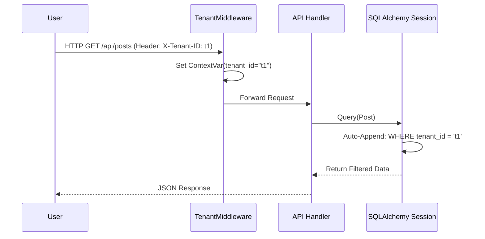

# System Architecture Specification

| 项目 | 内容 |
| :--- | :--- |
| **项目名称** | Lingxi · SoulGravity Enterprise |
| **版本** | 1.0.0 |
| **状态** | RFC (Request for Comments) |
| **作者** | SoulGravity Team |
| **最后更新** | 2026-02-15 |

---

## 1. 架构概览 (Architecture Overview)

### 1.1 愿景 (Vision)
构建一套**企业级、多租户、插件化**的社交媒体自动化中间件。它旨在屏蔽不同社交平台（如小红书、抖音）的底层差异，为上层业务提供统一的内容发布、数据采集和账号管理能力，同时保证高可用性与可扩展性。

### 1.2 设计哲学 (Design Philosophy)
*   **六边形架构 (Hexagonal Architecture)**: 核心业务逻辑（Core Kernel）与基础设施（DB, Redis, Web, Plugins）完全解耦。核心逻辑不依赖外部实现，通过接口（Port）与适配器（Adapter）交互。
*   **机制与策略分离 (Mechanism vs. Policy)**: 核心层提供调度、重试、限流等通用**机制**；插件层定义具体的平台交互**策略**。
*   **API First**: 所有功能优先通过 REST API 暴露，Web 控制台仅为 API 的消费者之一。

### 1.3 系统上下文 (System Context)

```mermaid
graph TD
    User[用户 / 业务系统] -->|HTTP/REST| Nginx[Nginx 反向代理]
    Nginx -->|转发| API[API Gateway (FastAPI)]
    
    subgraph "SoulGravity Cluster"
        API -->|读写| DB[(PostgreSQL)]
        API -->|缓存/队列| Redis[(Redis)]
        API -->|消息投递| MQ[(RabbitMQ)]
        
        MQ -->|消费| WorkerS[Worker: Scraper]
        MQ -->|消费| WorkerP[Worker: Publisher]
    end
    
    subgraph "External Platforms"
        WorkerS -->|HTTP/Playwright| XHS[小红书]
        WorkerS -->|HTTP/Playwright| DY[抖音]
        WorkerP -->|HTTP/Playwright| XHS
        WorkerP -->|HTTP/Playwright| DY
    end
```

---

## 2. 组件规范 (Component Specifications)

### 2.1 核心内核 (Core Kernel)
位于 `libs.core_kernel`，是系统的灵魂。
*   **PluginManager**: 负责在启动时动态加载 `plugins/platforms/` 下的所有适配器。它维护一个注册表，并在运行时根据 `platform_name` 分发任务。
*   **BasePlatformAdapter**: 定义了所有社交平台必须实现的**标准接口**。
    *   `login(credentials)`: 统一登录流程。
    *   `fetch_hot_trends(limit)`: 获取热点数据。
    *   `publish_content(payload)`:发布内容。
    *   任何不符合此接口的平台行为都通过适配器模式抹平。

### 2.2 基础设施 (Infrastructure)
位于 `libs.infra_*`，提供通用技术支持。
*   **TenantMixin**: 基于 SQLAlchemy 的模型混入类。自动在所有查询中注入 `WHERE tenant_id = :current_tenant_id`，确保多租户数据的**行级安全隔离** (RLS)。
*   **SmartClient**: 封装了 HTTP 请求（httpx）和浏览器操作（Playwright），内置了指纹混淆、代理轮询和重试机制，用于对抗反爬虫。

### 2.3 遥测与观测 (Telemetry)
位于 `libs.telemetry`。
*   **Correlation ID**: 每个 API 请求都会生成唯一的 `X-Request-ID`。该 ID 会被传递到 Celery 任务、日志系统甚至下游 HTTP 请求中，实现跨组件的全链路追踪。

---

## 3. 数据流规范 (Data Flow Specifications)

### 3.1 多租户请求流程 (Multi-tenancy Flow)



### 3.2 异步任务流程 (Async Task Flow)

1.  **提交**: 用户调用 API 提交发布任务。API 将任务元数据写入 DB (状态: `PENDING`)，并将任务 ID 推送至 RabbitMQ。
2.  **分发**: Celery Worker 从 RabbitMQ 获取任务。
3.  **执行**: Worker 根据任务类型（如 `publish`）和平台（如 `xiaohongshu`），从 `PluginManager` 获取对应的适配器实例并执行。
4.  **反馈**: 适配器返回执行结果。Worker 更新 DB 状态 (`SUCCESS`/`FAILED`) 并记录日志。

---

## 4. 目录结构标准 (Directory Structure)

采用 Monorepo 结构，统一管理所有代码资产。

| 目录 | 职责 |
| :--- | :--- |
| `apps/` | **应用程序入口**。包含可部署的服务，如 `api_gateway` (Web服务), `worker_scraper` (采集节点)。 |
| `libs/` | **共享库**。包含核心逻辑 `core_kernel`、数据库层 `infra_db`、安全模块 `security` 等。 |
| `plugins/` | **插件仓库**。包含具体的平台实现，如 `platforms/xiaohongshu`, `platforms/douyin`。 |
| `web-console/` | **前端控制台**。基于 React/Vite/AntD 的管理后台源码。 |
| `deploy/` | **部署配置**。Docker Compose, K8s manifests, Nginx 配置。 |
| `doc/` | **项目文档**。架构设计、API 文档、操作手册。 |
| `scripts/` | **运维脚本**。数据清洗 (Seed)、迁移辅助等。 |

---

## 5. 扩展指南 (Extension Guide)

### 5.1 添加新平台插件 (Backend)
1.  在 `plugins/platforms/` 下创建新目录，例如 `facebook/`。
2.  创建 `adapter.py`，继承 `libs.core_kernel.interfaces.platform.BasePlatformAdapter`。
3.  实现所有抽象方法 (`login`, `publish_content` 等)。
4.  在 `__init__.py` 中暴露该 Adapter 类。
5.  重启服务，`PluginManager` 会自动发现并加载新插件。

### 5.2 添加配置表单 (Frontend)
1.  在 `web-console/src/components/plugins/` 下创建对应平台的表单组件。
2.  使用 Ant Design 的 `<Form>` 组件定义该平台所需的特有字段（如 `api_key`, `secret_token`）。
3.  在前端的插件注册表中映射 `platform_name` 到该组件。
